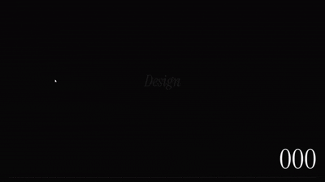

# Samay Portfolio

Personal portfolio website for **Samay Dudharejiya** built with React, TypeScript, Tailwind CSS, Framer Motion, GSAP, and Vite.

## Live Demo

View the live site here:

- [Live Demo](https://project-goal-create-a-modern-futuristic-n4ssf7m4s.vercel.app)

### Demo Preview

[](https://project-goal-create-a-modern-futuristic-n4ssf7m4s.vercel.app)

Click the preview above to open the live site.
## Overview

This portfolio is a premium single-page experience designed to showcase Samay's work, GitHub projects, resume, and contact details with smooth motion and a dark editorial style.

The site includes:

- A cinematic hero section
- Animated loading screen
- Selected work / project cards
- Visual playground gallery
- Journal-style project highlights
- Parallax and scroll-triggered motion
- Resume download support
- GitHub and contact links

## Tech Stack

- React 18
- TypeScript
- Vite
- Tailwind CSS
- Framer Motion
- GSAP
- ScrollTrigger
- HLS.js

## Features

- Smooth animated page entry
- Glassmorphism navigation
- Responsive layout for mobile and desktop
- Scroll-based parallax and reveal effects
- Clickable GitHub project cards
- Resume download button
- Live demo deployment on Vercel

## Local Development

### Install dependencies

```bash
npm install
```

### Run the development server

```bash
npm run dev
```

### Build for production

```bash
npm run build
```

### Preview production build

```bash
npm run preview
```

## Folder Structure

```text
.
├── public/
│   └── Samay_Dudharejiya_Resume.pdf
├── src/
│   ├── App.tsx
│   ├── index.css
│   └── main.tsx
├── index.html
├── package.json
├── tailwind.config.ts
├── postcss.config.cjs
├── tsconfig.json
└── vite.config.ts
```

## Resume

The resume is included in the site and can be downloaded directly from the top navigation or footer.

## GitHub

- [SAMAY-PORTFOLIO](https://github.com/1SAMAY/SAMAY-PORTFOLIO)
- [Samay GitHub Profile](https://github.com/1SAMAY)

## Contact

- Email: Samay4932@gmail.com
- Role: Full Stack Developer (Ongoing)
